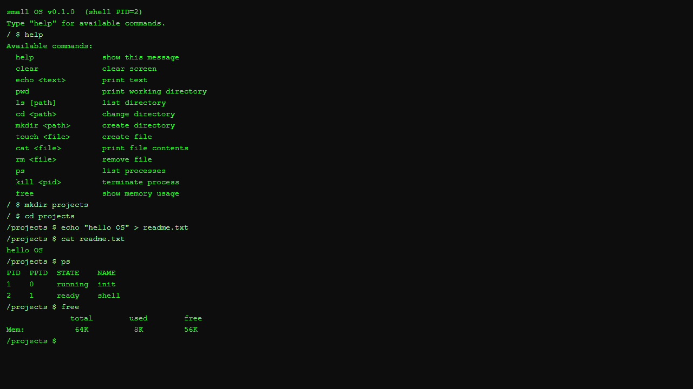

# small OS

**ブラウザで動く OS コンセプト・シミュレーター。TypeScript + Vite 実装。**

> これはブート可能な実 OS ではありません。OS の基本概念をブラウザ上で体験するための学習用シミュレーターです。



プロセス管理・ファイルシステム・メモリ管理・システムコールなど OS の基本概念をインストール不要で体験できます。  
MIT の教育用 OS「xv6」と同じアプローチで、**動くコードを読み・変更し・壊して直す**ことで OS を学びます。

## 5 分で体験

```bash
git clone https://github.com/rex0220/small-os.git
cd small-os
npm install
npm run dev
```

`http://localhost:5173` をブラウザで開き、以下を順に入力してください。

```
help
mkdir test
cd test
echo "hello OS" > memo.txt
cat memo.txt
ps
free
```

ページをリロードしてもう一度 `cat memo.txt` を実行してみてください。  
ファイルが残っているはずです（localStorage に永続化されています）。

## 使えるコマンド

| コマンド | 説明 |
|---|---|
| `help` | コマンド一覧 |
| `ls [path]` | ディレクトリ一覧 |
| `cd <path>` | ディレクトリ移動 |
| `mkdir <path>` | ディレクトリ作成 |
| `touch <file>` | ファイル作成 |
| `cat <file>` | ファイル内容を表示 |
| `echo <text>` | テキスト出力 |
| `rm <file>` | ファイル削除 |
| `ps` | プロセス一覧 |
| `kill <pid>` | プロセス終了 |
| `free` | メモリ使用状況 |
| `clear` | 画面クリア |

パイプ・リダイレクトにも対応しています。

```bash
echo "hello" > memo.txt
cat memo.txt | echo
echo "world" >> memo.txt
```

## アーキテクチャ

```
┌──────────────────────────────────────────┐
│             ユーザー空間                  │
│  Terminal UI  ←→  Shell / コマンド群     │
├──────────────────┬───────────────────────┤
│   カーネル空間    │                       │
│     Syscall.ts  ← ユーザー/カーネル境界   │
│  Scheduler  │  MemoryManager  │  FileSystem │
│  InterruptController (setInterval 10ms)   │
├───────────────────────────────────────────┤
│  setTimeout / setInterval / localStorage  │
└───────────────────────────────────────────┘
```

| 実 OS の概念 | small OS での実装 |
|---|---|
| CPU 特権モード（Ring 0/3） | Syscall.ts による境界 |
| プロセス | Web Worker + PCB |
| コンテキストスイッチ | yield / resume メッセージ |
| ページング | ArrayBuffer 64KB ÷ 4KB ページ |
| ファイルシステム | inode + localStorage |
| タイマー割り込み | setInterval 10ms |

## 本物の OS との違い

small OS はあくまでシミュレーターです。以下の点は実 OS とは異なります。

| 実 OS | small OS |
|---|---|
| CPU の特権モード切替（Ring 0/3）でカーネル保護 | Syscall.ts による**ソフトウェア的**な境界 |
| プロセスごとに独立したメモリ空間 | Web Worker による分離（共有メモリは防げない） |
| CPU によるプリエンプション | 協調方式（Worker 自身が yield を送る） |
| レジスタ退避・復元によるコンテキストスイッチ | メッセージパッシング（yield / resume） |
| ページテーブルを MMU がハードウェア管理 | JavaScript 上のページテーブルをソフトウェアで模擬 |

これらの違いを理解しながら学ぶことも、この教材の目的の一つです。

## 技術スタック

- TypeScript 5.5
- Vite 5.4
- Web Workers API（プロセス並行実行）
- localStorage（ファイルシステム永続化）

## ドキュメント

- [仕様書](docs/spec.md)
- [学習プラン](docs/learning-plan.md)
- [チュートリアル（Qiita 記事用）](docs/qiita-tutorial.md)

## ライセンス

MIT
